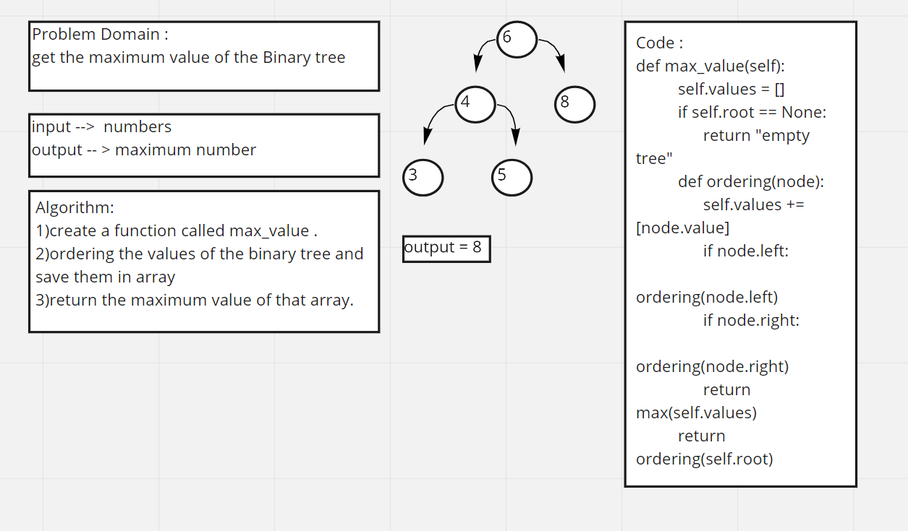

PR link:
https://github.com/Aseelalsaqer/data-structures-and-algorithms/pull/32

White Board CC16:

Approach & Efficiency:
the approche i worked in that i taked the values of the tree after traverse and put them in an array and take the max value of that array Big O: Time: O(n) Space: O(1)
