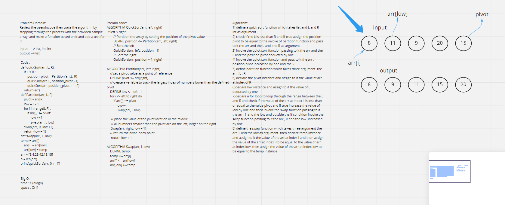
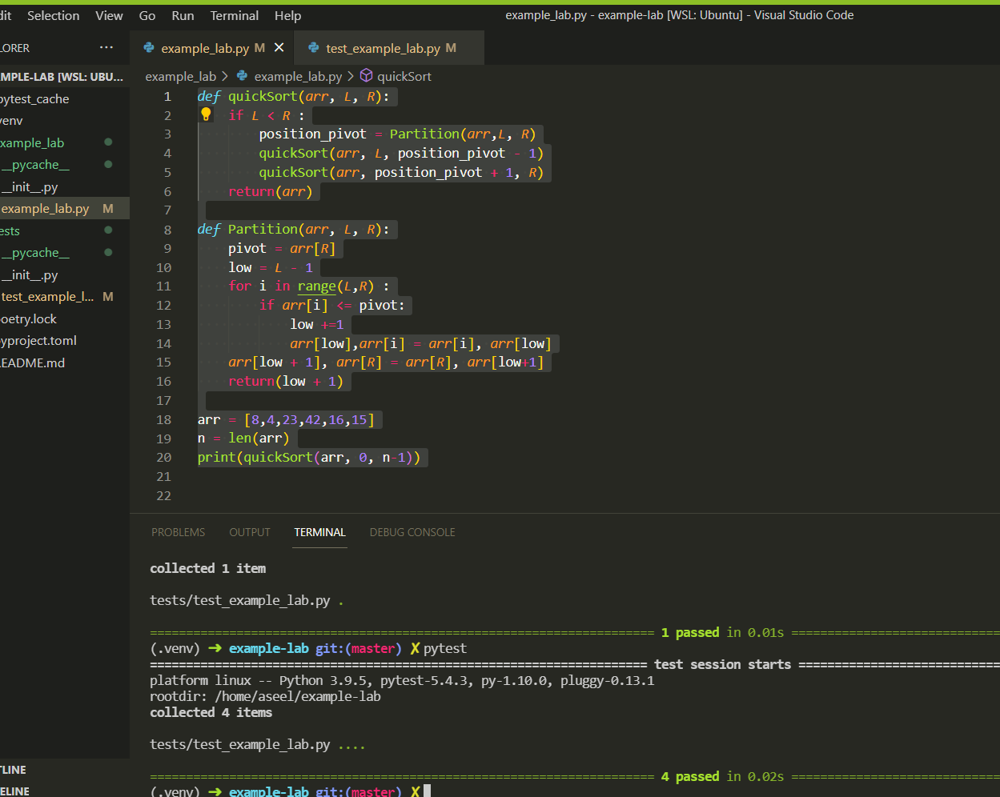

# Challenge Summary

Track the Pesudo Code of Quicksort .

## White Boared:

## Approach & Efficiency

O(n^2)

## Solution

python/code_challenges/ QuickSort/BLOG.md

## Test:

-   I worked with Ehab Ahmad.
