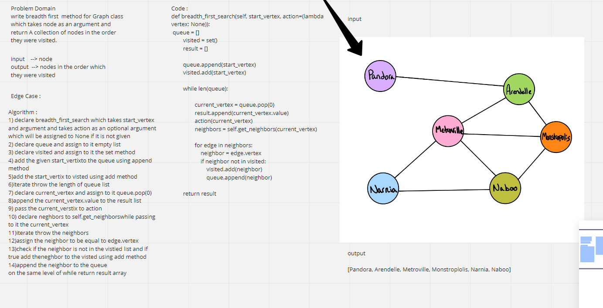

# Graphs
Implement your own Graph. The graph should be represented as an adjacency list:

## Challenge
to write methods for graph data structure.

## API's:

AddNode() AddEdge() GetNodes() GetNeighbors() Size()

test : python/tests/test_graph.py

# Challenge Summary
method for the Graph class:

breadth first
Arguments: Node
Return: A collection of nodes in the order they were visited.
Display the collection

## Whiteboard Process

## Approach & Efficiency
time = O(n^2)

