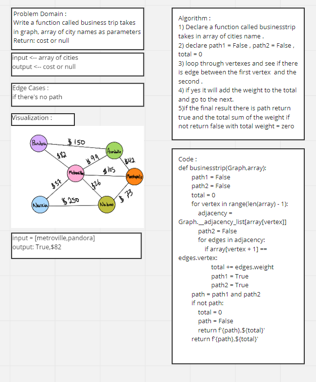
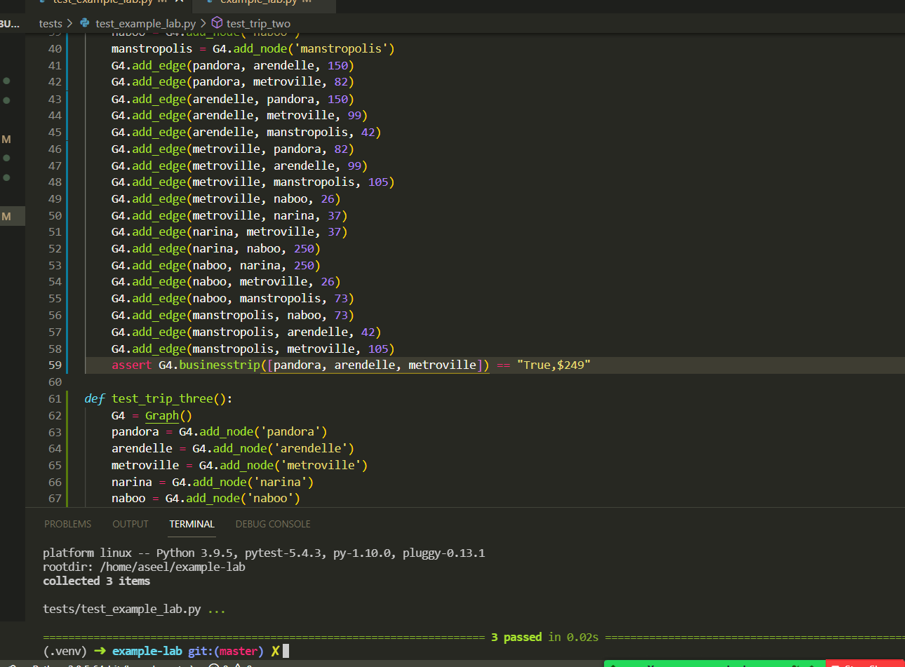
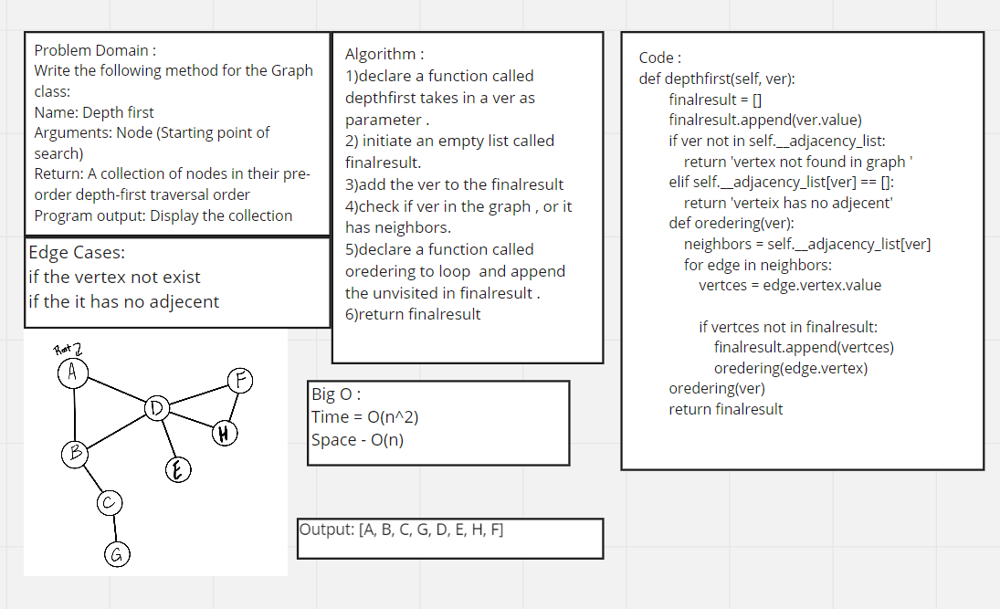
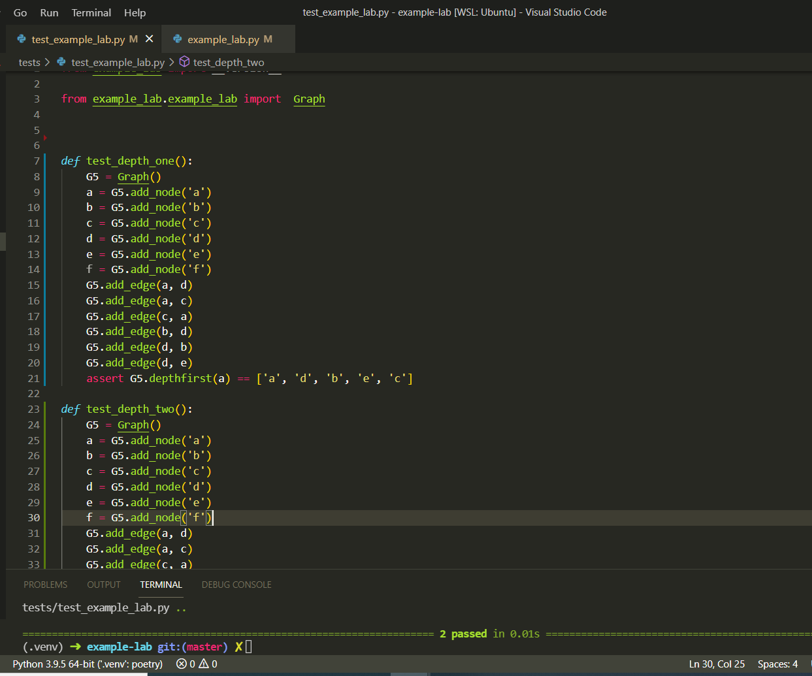

# Graphs
Implement your own Graph. The graph should be represented as an adjacency list:

## Challenge
to write methods for graph data structure.

## API's:

AddNode() AddEdge() GetNodes() GetNeighbors() Size()

test : python/tests/test_graph.py

# Challenge Summary
method for the Graph class:

breadth first
Arguments: Node
Return: A collection of nodes in the order they were visited.
Display the collection

## Whiteboard Process

## Approach & Efficiency
time = O(n^2)

# Challenge Summary
Write a function called business trip
Arguments: graph, array of city names
Return: cost or null

## Whiteboard Process

## Approach & Efficiency
Big O :
Time = O(n^2)
space = O(n)

## test :

# Depth First Traversal
method for the Graph class:

Name: Depth first
Arguments: Node (Starting point of search)
Return: A collection of nodes in their pre-order depth-first traversal order
Program output: Display the collection

## Approach & Efficiency
Big O :
Time = O(n^2)
Space - O(n)

## Solution

## test :

