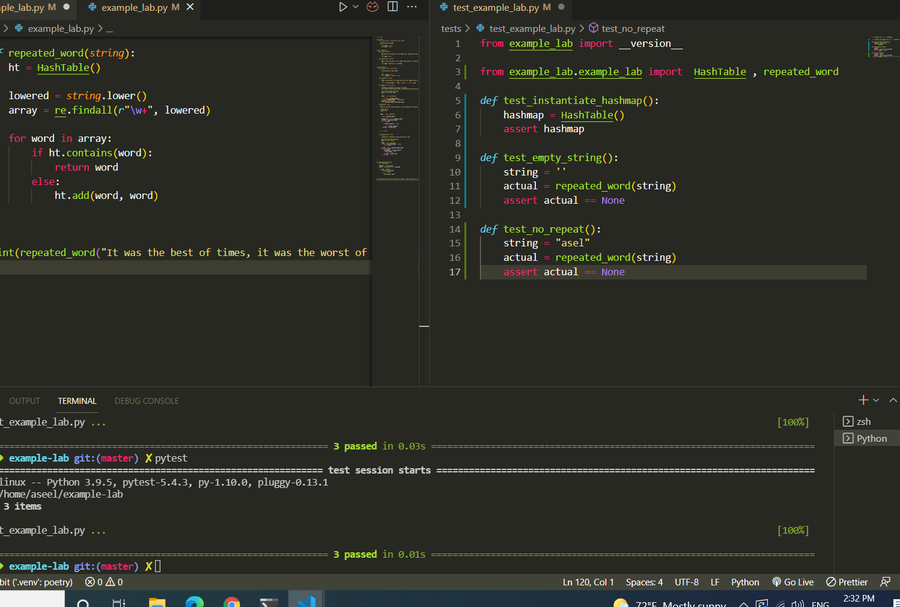

PR Link : https://github.com/Aseelalsaqer/data-structures-and-algorithms/pull/39

# Challenge Summary
Find the first repeated word in a book using hash table

## Whiteboard Process
<!-- Embedded whiteboard image -->

## Approach & Efficiency
time : o(n)

## test:

python/tests/test_repeated.py
