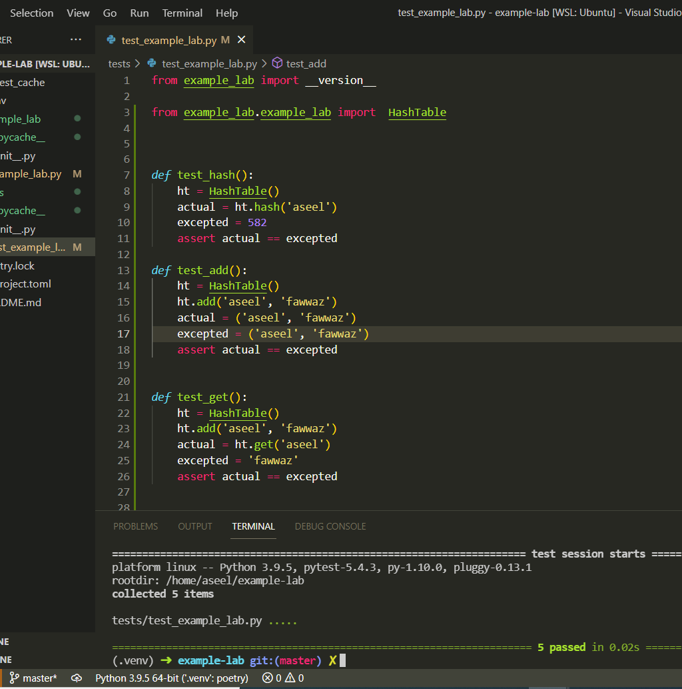
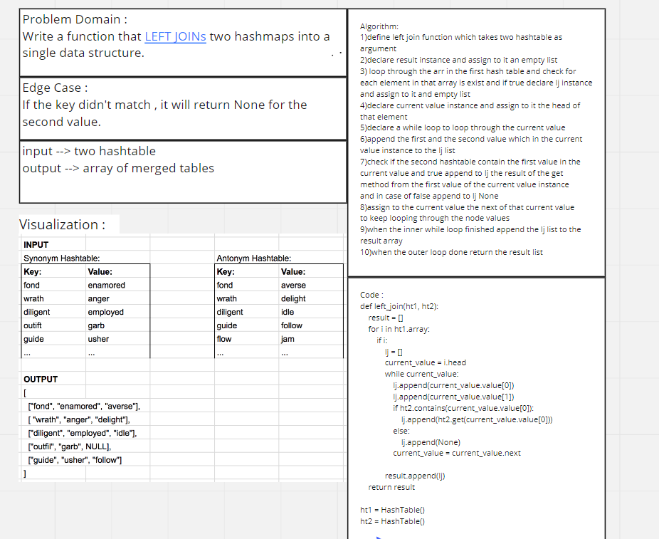

# Hashtables
Implement a Hashtable Class with the following methods:
- add
- get
- contain
- hash

## PR Link:
https://github.com/Aseelalsaqer/data-structures-and-algorithms/pull/38

## Approach & Efficiency
add: BigO = O(n)

get: BigO = O(n)

contains: BigO = O(n)

hash: BigO = O(1)

## API
- add Arguments: key, value Returns: nothing This method should hash the key, and add the key and value pair to the table, handling collisions as needed.
- get Arguments: key Returns: Value associated with that key in the table contains Arguments: key Returns: Boolean, indicating if the key exists in the table already.
- hash Arguments: key Returns: Index in the collection for that .
- conatin Argument: key Returns True , False .

## test :

#######################################
# Hashmap LEFT JOIN
Write a function that LEFT JOINs two hashmaps into a single data structure.

Write a function called left join
Arguments: two hash maps
The first parameter is a hashmap that has word strings as keys, and a synonym of the key as values.
The second parameter is a hashmap that has word strings as keys, and antonyms of the key as values.
Return: The returned data structure that holds the results is up to you. It doesn’t need to exactly match the output below, so long as it achieves the LEFT JOIN logic

## Approach & Efficiency
Big O :
Time = O(n^2)

## Solution

## test :

